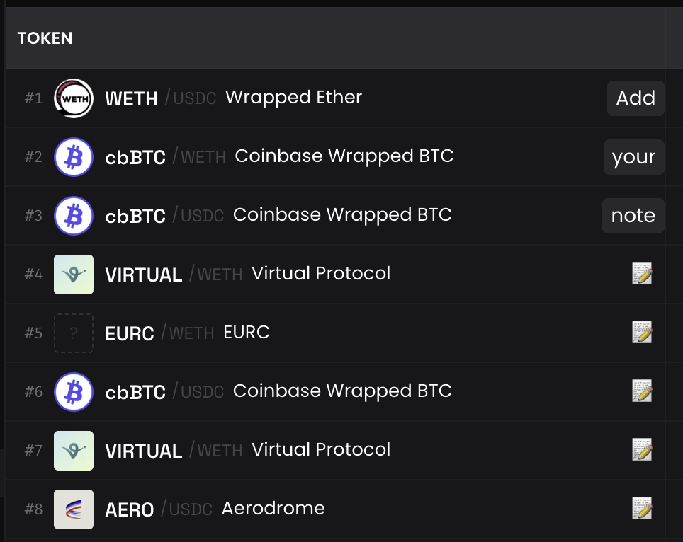

# DEX Screener Notes

A Chrome extension that allows you to add and save notes to pools on DEX Screener.

## Features

- Add notes to any pool on DEX Screener
- Notes are saved locally and persist between sessions
- Easy-to-use interface with a simple 📝 button

## Installation

1. Download or clone this repository
2. Open Chrome and go to `chrome://extensions/`
3. Enable "Developer mode" in the top right corner
4. Click "Load unpacked" and select the directory containing the extension files

## Usage

1. Visit any DEX Screener page
2. Look for the 📝 button next to pools
3. Click the button to add a note
4. Enter your note and click "Save" or [CMD+ENTER]
5. Your note will appear persist on DEX Screener and click again to edit

## Files

- `manifest.json`: Extension configuration
- `content.js`: Main functionality for adding and managing notes
- `styles.css`: Styling for the note interface
- `popup.html`: Simple popup interface
- `icons/`: Directory containing extension icons

## Note

This extension stores all notes locally in your browser using Chrome's storage API. Notes are not synced across devices or browsers.
